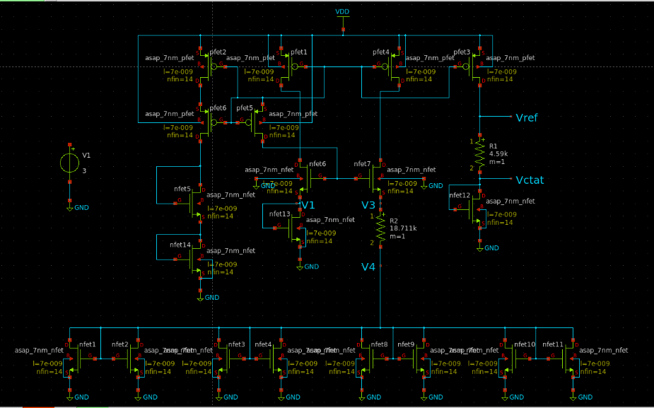
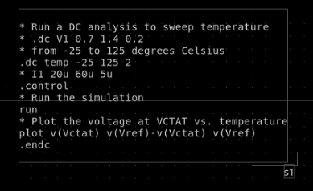
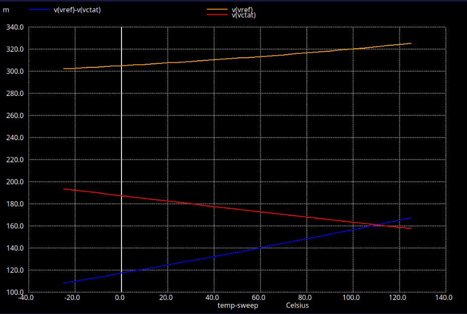

# Bandgap Reference Circuit - ASAP 7nm Technology

A complete bandgap reference (BGR) circuit design using ASAP 7nm FinFET technology with temperature compensation and voltage-temperature characteristic (VTC) analysis.

## Project Overview

This project implements a temperature-independent voltage reference circuit using the bandgap principle, combining PTAT (Proportional to Absolute Temperature) and CTAT (Complementary to Absolute Temperature) voltages to generate a stable reference voltage across temperature variations.

## Circuit Schematic



The complete BGR circuit includes:
- Self-biased current mirror (top section with PFETs)
- PTAT and CTAT voltage generators
- Startup circuit (bottom NFETs array)
- Resistor network for voltage scaling
- Key nodes: Vref (reference output), Vctat (CTAT voltage), V1, V3, V4

## Key Specifications

| Parameter | Min | Typical | Max | Unit | Condition |
|-----------|-----|---------|-----|------|-----------|
| Vref | 303.125 | - | 325 | mV | T = -25°C to 125°C, VDD = 0.7V |
| VDD | - | 0.7 | - | V | Supply Voltage |
| IDD | - | 20 | - | µA | Supply Current |
| R1 | - | 4.59 | - | kΩ | PTAT Resistor |
| R2 | - | 18.711 | - | kΩ | CTAT Resistor |
| Temp Coefficient | - | 0.14583 | - | mV/K | T = -25°C to 125°C |

## Project Structure

```
BGR_7nm_Project/
├── README.md                    # This file
├── circuits/
│   └── bgr_main.sch            # Main BGR circuit schematic
├── spice/
│   ├── bgr_main.spice          # Main BGR SPICE netlist
│   └── bgr_vtc_sweep.spice     # VTC sweep simulation
├── models/
│   ├── asap_7nm_nfet.sym       # NFET symbol
│   ├── asap_7nm_pfet.sym       # PFET symbol
│   └── bsimcmg.osdi            # BSIMCMG model
└── results/
    └── README.md               # Simulation results documentation
```

## Circuit Description

The BGR circuit consists of:

1. **PTAT Generator**: Creates voltage proportional to absolute temperature
2. **CTAT Generator**: Creates voltage complementary to absolute temperature  
3. **Current Mirror**: Self-biased current mirror for stable biasing
4. **Startup Circuit**: Ensures proper circuit initialization
5. **Resistor Network**: R1 (4.59kΩ) and R2 (18.711kΩ) for voltage scaling

### Reference Voltage Equation

```
Vref = Vctat + α × Vptat
```

Where α = 0.5100373 is calculated from temperature coefficients.

## Simulation Setup



### Temperature Sweep (VTC)
- Temperature range: -25°C to 125°C
- Step: 2°C
- Supply voltage: 0.7V

The simulation performs a DC temperature sweep and plots:
- `v(Vctat)` - CTAT voltage (red curve)
- `v(Vref)-v(Vctat)` - PTAT component (blue curve)
- `v(Vref)` - Final reference voltage (yellow curve)

### Running Simulations

```bash
# Navigate to spice directory
cd spice

# Run VTC sweep simulation
ngspice bgr_vtc_sweep.spice
```

## Simulation Results



The temperature sweep results show:
- **Vref (yellow)**: Reference voltage remains relatively stable around 310-320mV across temperature
- **Vctat (red)**: CTAT voltage decreases from ~190mV to ~160mV as temperature increases
- **Vref-Vctat (blue)**: PTAT component increases from ~120mV to ~160mV with temperature

This demonstrates the temperature compensation principle where PTAT and CTAT components balance each other to create a stable reference voltage.

## Design Methodology

1. Calculate PTAT and CTAT temperature coefficients
2. Determine α coefficient for temperature compensation
3. Calculate resistor values using thermal voltage and current ratio
4. Design current mirror for stable biasing
5. Add startup circuit to avoid zero-current state
6. Simulate and verify across temperature range

## Tools Required

- Xschem (Schematic Capture)
- Ngspice (SPICE Simulator)
- ASAP 7nm PDK
- BSIMCMG OSDI model

## References

- ASAP 7nm PDK Documentation
- Bandgap Reference Circuit Theory
- FinFET Device Modeling

## Author

Created for educational and research purposes using ASAP 7nm technology.
